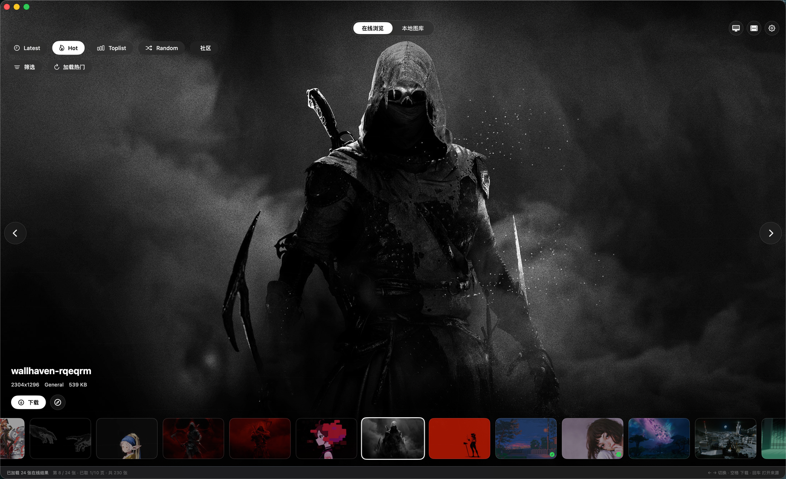

# Wallhaven Wallpaper

macOS 原生壁纸工具（SwiftUI + SwiftData），集 Wallhaven 在线浏览、下载管理、桌面设置、视频动态桌面与自动轮换于一体。



## 功能

### 在线浏览

- 分类：Latest、Hot、Toplist、Random、社区搜索（关键词 / 标签 / `id:123` / `@用户`）
- 筛选抽屉：排序与倒序、Toplist 时间范围、分辨率匹配（至少 / 精确等）、颜色、内容类型（General / Anime / People）、纯度（SFW / Sketchy / NSFW）、比例；草稿编辑，应用后统一生效
- 沉浸式单图舞台 + 底部缩略图条；触摸板左滑到缩略图末尾自动续取下一页，方向键翻到缓冲区末尾同样自动续页
- 空结果兜底：非搜索类别自动回退默认筛选重试，搜索类别保留手动入口
- NSFW 模糊保护：Sketchy / NSFW 图片按设置模糊显示，主图可点眼睛图标临时揭示
- 缓存复用：搜索结果与缩略图均走本地缓存，重复浏览几乎零流量

### 本地图库

- SwiftData 保存元数据，原图按日期或月份分组存入本地目录
- Quick Look 预览、Finder 定位、拖拽导出
- 移到废纸篓并同步删除图库记录
- 已下载的在线图可直接设为桌面壁纸

### 桌面集成

- 设为当前屏幕或全部屏幕壁纸
- 桌面壁纸模拟预览：全屏预览效果但不改系统桌面
- 视频动态桌面：选择本地 `.mp4 / .mov`，桌面层窗口循环播放（不抢焦点、忽略鼠标），支持静音、默认全部屏幕、低电量模式暂停

### 自动换壁纸

- 定时间隔自动切换桌面壁纸
- 切换顺序：随机 / 顺序 / 倒序 / 新图优先 / 旧图优先
- 可选仅当前屏幕或全部屏幕，设置页显示可用候选数并支持手动启动 / 停止 / 下一张

### 缓存与隐私

- 缓存路径 `~/Library/Caches/WallhavenWallpaper`，可设最大容量（500 MB / 1 GB / 2 GB），支持按搜索结果、缩略图或全部清理
- Wallhaven API Key 保存在系统 Keychain
- 附带 `PrivacyInfo.xcprivacy` 隐私清单

## 快捷键

| 按键 | 作用 |
| --- | --- |
| `⌘1` / `⌘2` | 切换在线浏览 / 本地图库 |
| `←` `↑` / `→` `↓` | 上一张 / 下一张（长按连翻，末尾自动续页） |
| 空格 | 在线：下载当前图；图库：设为桌面壁纸 |
| 回车 | 在线：打开来源页；图库：Quick Look 预览 |
| `Esc` | 退出壁纸模拟预览 / 关闭筛选抽屉 |

## 系统要求

- macOS 14.0 或更高
- Swift 6 工具链（`swift-tools-version: 6.0`）

## 运行

```bash
swift run
```

## 打包

```bash
Scripts/package_app.sh
open build/WallhavenWallpaper.app
```

默认 ad-hoc 签名，产物为 `build/WallhavenWallpaper.app`（含 Apple 标准 `AppIcon.icns`）。发布时传入正式证书：

```bash
APP_IDENTITY="Developer ID Application: Your Name" Scripts/package_app.sh
```

## 项目结构

| 文件 | 职责 |
| --- | --- |
| `ContentView.swift` | 主界面：舞台、缩略图条、筛选抽屉、键盘导航 |
| `WallhavenService.swift` | Wallhaven API 请求与下载 |
| `AppCacheStore.swift` | 搜索结果与图片缓存 |
| `KeychainStore.swift` | API Key 的 Keychain 存取 |
| `AppSettingsView.swift` | 设置弹窗：Wallhaven / 下载 / 缓存 / 动态桌面 / 自动换壁纸 |
| `VideoWallpaperController.swift` | 视频动态桌面窗口与播放 |
| `WallpaperRotationController.swift` | 定时轮换桌面壁纸 |
| `Models.swift` | SwiftData 模型与筛选枚举 |

## 说明

- NSFW 默认关闭；开启 NSFW 浏览通常需要 Wallhaven API Key。敏感内容默认模糊，需手动揭示。
- 视频动态桌面使用公开 macOS API 模拟：创建桌面层窗口并以 `AVPlayerLayer` 硬件解码循环播放。
- 普通 App 无法替换系统锁屏界面，锁屏动态效果需另行开发 `.saver` 屏保插件。
- 若计划上架 App Store，需认真处理年龄分级、内容来源与审核说明。
